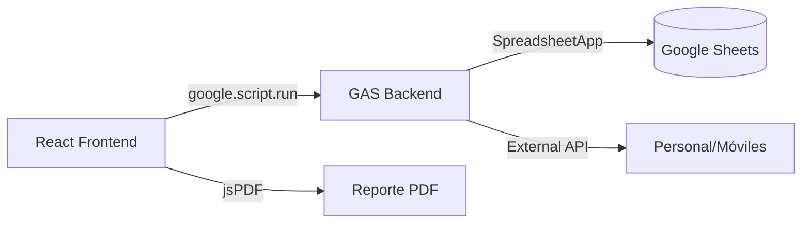

# Análisis del Proyecto: Reporte de Servicio

Este proyecto es una aplicación web moderna diseñada para la gestión y generación de reportes integrados de seguridad ciudadana para la Municipalidad de Surco. Está construida con **React**, **TypeScript** y **Vite**, y optimizada para ser desplegada como un Web App en **Google Apps Script (GAS)**.

## Arquitectura del Sistema

El sistema sigue un modelo de cliente-servidor integrado:

- **Frontend (React/Vite):** Una Single Page Application (SPA) que se compila en un único archivo HTML (`index.html`) para ser compatible con GAS. Utiliza **Tailwind CSS** para el diseño y **jsPDF** para la generación de reportes en el cliente.
- **Backend (Google Apps Script):** Actúa como el motor de persistencia y lógica de negocio, comunicándose con **Google Sheets** para almacenar y recuperar datos.

### Diagrama de Comunicación

## Componentes Clave

1.  **`App.tsx`:** El orquestador principal. Gestiona el estado global (unidades, configuraciones, sector actual), la sincronización con el backend y el enrutamiento interno entre vistas.
2.  **`Code.gs`:** Implementa funciones de persistencia con bloqueo de escritura (`LockService`) para evitar colisiones de datos y gestiona el acceso a hojas de cálculo externas.
3.  **Vistas Principales:**
    - **Dashboard:** Edición en tiempo real de unidades (Choferes, Motos, Serenos) por sector.
    - **Visualización:** Vista consolidada de todos los sectores para el Reporte Integrado.
    - **Personal:** Gestión de la base de datos de personal operativo.
    - **Estadísticas:** Análisis visual de métricas operativas.

## Modelo de Datos (`types.ts`)

El sistema utiliza interfaces estrictas para garantizar la integridad de los datos:

- **`UnitData`:** Define los atributos de una unidad (placa, indicativo, radio, estado, KM, combustible, etc.).
- **`Sector`:** Enumera los sectores operativos (1A, 1B, ..., RESCATE, GIR).
- **`UnitStatus`:** Estados operativos predefinidos (PATRULLANDO, MAESTRANZA, etc.).

## Características Destacadas

- **Gestión Histórica:** Los datos se guardan y recuperan basados en la combinación de **Fecha + Turno (Mañana/Tarde/Noche)**.
- **Generación de Reportes:** El motor de PDF construye reportes apaisados A4 que consolidan la información de todos los sectores de manera profesional.
- **Integración de Datos:** Consume datos de móviles y personal de hojas de cálculo externas, permitiendo autocompletado inteligente en los formularios.
- **Resiliencia:** El sistema carga valores por defecto (`SECTOR_DATA`) si no encuentra registros previos para una fecha/turno específica.

## Tecnologías Utilizadas

- **Frontend:** React 18, TypeScript, Vite, Tailwind CSS.
- **Backend:** Google Apps Script, JavaScript (V8).
- **Librerías:** jsPDF, jsPDF-autotable, Lord-icon, Material Symbols.
